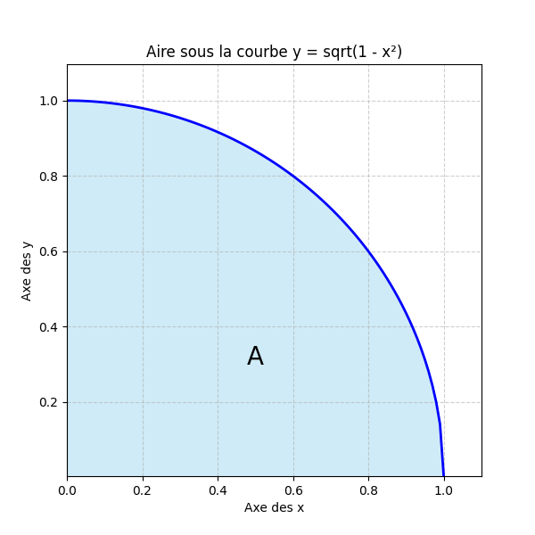

# Mini-Projet : Comparaison de Performance CPU vs GPU

Ce projet est une démonstration simple mais puissante de l'accélération fournie par un GPU (Graphics Processing Unit) par rapport à un CPU (Central Processing Unit) pour des tâches de calcul parallèle.

## Le Problème : Estimer Pi (π) avec la Méthode de Monte-Carlo

L'objectif est d'estimer la valeur de π sans la calculer directement, en utilisant une méthode probabiliste qui simule un jeu de lancer de fléchettes.

### La Théorie

On se base sur le rapport entre l'aire d'un quart de cercle de rayon 1 et l'aire d'un carré de côté 1. En lançant des milliers de "fléchettes" (points aléatoires) sur cette cible, on peut estimer π avec la formule : `π ≈ 4 * (nombre de points dans le cercle / nombre total de points)`.

Chaque lancer étant un calcul **indépendant**, ce problème est parfaitement adapté au **calcul parallèle** sur GPU.

### La Démonstration Mathématique (Solution Analytique)

Pour prouver que l'aire du quart de cercle est bien `π/4`, on peut la calculer de manière analytique en utilisant une intégrale. C'est la méthode "exacte", par opposition à la méthode "estimée" de Monte-Carlo.

L'aire `A` que nous cherchons correspond à la surface sous la courbe de la fonction `y = sqrt(1-x²)` entre `x=0` et `x=1`, comme le montre ce graphe :



Le calcul ci-dessous détaille comment résoudre l'intégrale correspondante.

**1. Définition du Domaine**

Le domaine `D` est le quart de cercle unité dans le premier quadrant, défini par :

$$
D = \{ (x, y) \in \mathbb{R}^2 \mid 0 \le x \le 1, \  0 \le y \le \sqrt{1-x^2} \}
$$

L'arc de cercle suit l'équation :

$$
x^2+y^2=1 \implies y = \sqrt{1-x^2} \quad (\text{pour } y \ge 0)
$$

**2. Mise en place de l'Intégrale**

L'aire `A` de ce domaine peut être calculée avec une intégrale double :

$$
\begin{aligned}
A &= \iint_D 1 \ dxdy \\
&= \int_{0}^{1} \int_{0}^{\sqrt{1 - x^2}} 1 \ dy \ dx \\
&= \int_{0}^{1} \sqrt{1 - x^2} \ dx
\end{aligned}
$$

**3. Changement de variable**

Cette intégrale est difficile à calculer directement. On effectue donc une substitution trigonométrique :

$$
x = \sin(\theta) \implies dx = \cos(\theta) \ d\theta
$$

Il faut aussi changer les bornes de l'intégration :

$$
\text{Si } x = 0, \text{ alors } \sin(\theta) = 0 \implies \theta = 0
$$

$$
\text{Si } x = 1, \text{ alors } \sin(\theta) = 1 \implies \theta = \frac{\pi}{2}
$$

En remplaçant `x` et `dx` dans l'intégrale, on obtient :

$$
A = \int_{0}^{\pi/2} \sqrt{1 - \sin^2(\theta)} \cdot \cos(\theta) \ d\theta
$$

Puisque `1 - sin²(θ) = cos²(θ)` et que `cos(θ) ≥ 0` sur l'intervalle `[0, π/2]`, l'intégrale se simplifie en :

$$
A = \int_{0}^{\pi/2} \cos^2(\theta) \, d\theta
$$

Pour résoudre cette intégrale, on utilise l'identité de l'angle double :

$$
\cos^2(\theta) = \frac{1 + \cos(2\theta)}{2}
$$

Le calcul final devient :

$$
\begin{aligned}
A &= \int_{0}^{\pi/2} \frac{1 + \cos(2\theta)}{2} \, d\theta \\
&= \frac{1}{2} \int_{0}^{\pi/2} (1 + \cos(2\theta)) \, d\theta \\
&= \frac{1}{2} \left[ \theta + \frac{1}{2}\sin(2\theta) \right]_{0}^{\pi/2} \\
&= \frac{\pi}{4}
\end{aligned}
$$

Cette démonstration confirme la base théorique de notre projet : l'aire du quart de cercle unité est bien **π/4**.


## Les Trois Méthodes Comparées

1.  **CPU (Séquentiel) :** Une boucle `for` simple qui traite chaque fléchette l'une après l'autre. C'est notre référence lente.
2.  **GPU (Brute Force) :** Utilise CuPy pour traiter toutes les fléchettes en parallèle sur le GPU en une seule fois.
3.  **GPU (Optimisé) :** Utilise une approche par "lots" (batching) pour optimiser l'utilisation de la mémoire du GPU.

## Résultats Obtenus

--- 1. Calcul sur CPU avec une boucle for sur 100,000,000 points ---
Estimation de π (CPU) ≈ 3.141406
Temps de calcul (CPU) : 29.6060 secondes

--- 2. Calcul sur GPU 'par lots' sur 100,000,000 points ---
Estimation de π (GPU par lots) ≈ 3.141609
Temps de calcul (GPU par lots) : 0.4219 secondes

--- 3. Calcul sur GPU Optimisé avec un Kernel CUDA sur 100,000,000 points ---
Estimation de π (GPU Optimisé) ≈ 3.141913
Temps de calcul (GPU Optimisé) : 0.0166 secondes

==================================================
           TABLEAU FINAL DES RÉSULTATS
==================================================
Nombre de points simulés : 10,000,000
--------------------------------------------------
Méthode CPU (lent)      : Temps: 2.3532s
Méthode GPU (brute force) : Temps: 0.2035s
Méthode GPU (optimisé)    : Temps: 0.0472s
==================================================
✅ Le GPU (brute force) est 12 fois plus rapide que le CPU.
✅ Le GPU (optimisé) est 50 fois plus rapide que le CPU.
==================================================


## Comment l'exécuter

Ce projet est conçu pour être exécuté dans un environnement disposant d'un GPU Nvidia et de CUDA.

### Méthode 1 : En local (si vous avez un GPU Nvidia)

1.  Clonez ce dépôt sur votre machine :
    ```bash
    git clone https://github.com/Juba451/cpu-vs-gpu-pi-estimation.git
    cd cpu-vs-gpu-pi-estimation
    ```
2.  Installez les dépendances nécessaires :
    ```bash
    pip install -r requirements.txt
    ```
3.  Lancez le script principal :
    ```bash
    python main.py
    ```

### Méthode 2 : Sur Google Colab (recommandé et gratuit)

Cette méthode vous permet de faire tourner le projet directement depuis GitHub.

1.  Ouvrez un [nouveau notebook sur Google Colab](https://colab.research.google.com).
2.  **Activez le GPU :** Allez dans `Runtime` -> `Change runtime type` et sélectionnez `GPU` comme "Hardware accelerator".
3.  Dans une seule cellule de code, copiez-collez les commandes suivantes pour cloner le projet et l'exécuter :

    ```python
    # 1. Cloner le dépôt GitHub
    !git clone https://github.com/Juba451/cpu-vs-gpu-pi-estimation.git

    # 2. Se déplacer dans le dossier du projet
    %cd cpu-vs-gpu-pi-estimation

    # 3. Installer les dépendances et lancer le script principal
    !pip install -r requirements.txt && python main.py
    ```
4.  Exécutez la cellule. Les résultats s'afficheront directement dans la sortie.


this is some text i added
