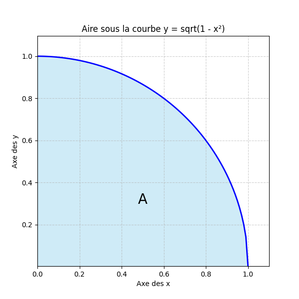

# CPU vs GPU -- Estimation de π par Monte-Carlo

Ce projet est une démonstration simple mais puissante de l'accélération fournie par un GPU (Graphics Processing Unit) par rapport à un CPU (Central Processing Unit) pour des tâches de calcul parallèle.

## Problème & Approche

L'estimation de π par Monte-Carlo repose sur un principe simple : en tirant aléatoirement des points dans un carré unitaire, la proportion de points tombant dans le quart de cercle inscrit converge vers π/4.

## Principe

On génère des points aléatoires dans le carré unité $[0, 1]^2$. Comme un lancer de fléchettes.

Un point appartient au quart de cercle unité lorsque :

$$x^2 + y^2 \le 1$$

La proportion de points situés dans le cercle permet alors d'estimer π.

Si $(X, Y)$ est uniforme dans $[0, 1]^2$,

$$P(X^2 + Y^2 \le 1) = \frac{\text{aire du quart de cercle}}{\text{aire du carré}}$$

Donc

$$P(X^2 + Y^2 \le 1) = \frac{\pi}{4}$$

### La Démonstration Mathématique (Solution Analytique)

Pour prouver que l'aire du quart de cercle est bien `π/4`, on peut la calculer de manière analytique en utilisant une intégrale. C'est la méthode "exacte", par opposition à la méthode "estimée" de Monte-Carlo.

L'aire `A` que nous cherchons correspond à la surface sous la courbe de la fonction $y = \sqrt{1-x^2}$ entre $x=0$ et $x=1$, comme le montre ce graphe :



Le calcul ci-dessous détaille comment résoudre l'intégrale correspondante.

**1. Définition du Domaine**

Le domaine `D` est le quart de cercle unité dans le premier quadrant, défini par :

$$
D = \{ (x, y) \in \mathbb{R}^2 \mid 0 \le x \le 1, \  0 \le y \le \sqrt{1-x^2} \}
$$

L'arc de cercle suit l'équation :

$$
x^2+y^2=1 \implies y = \sqrt{1-x^2} \quad (\text{pour } y \ge 0)
$$

**2. Mise en place de l'Intégrale**

L'aire `A` de ce domaine peut être calculée avec une intégrale double :

$$
\begin{aligned}
A &= \iint_D 1 \ dxdy \\
&= \int_{0}^{1} \int_{0}^{\sqrt{1 - x^2}} 1 \ dy \ dx \\
&= \int_{0}^{1} \sqrt{1 - x^2} \ dx
\end{aligned}
$$

**3. Changement de variable**

Cette intégrale est difficile à calculer directement. On effectue donc une substitution trigonométrique :

$$
x = \sin(\theta) \implies dx = \cos(\theta) \ d\theta
$$

Il faut aussi changer les bornes de l'intégration :

$$
\text{Si } x = 0, \text{ alors } \sin(\theta) = 0 \implies \theta = 0
$$

$$
\text{Si } x = 1, \text{ alors } \sin(\theta) = 1 \implies \theta = \frac{\pi}{2}
$$

En remplaçant `x` et `dx` dans l'intégrale, on obtient :

$$
A = \int_{0}^{\pi/2} \sqrt{1 - \sin^2(\theta)} \cdot \cos(\theta) \ d\theta
$$

Puisque `1 - sin²(θ) = cos²(θ)` et que `cos(θ) ≥ 0` sur l'intervalle `[0, π/2]`, l'intégrale se simplifie en :

$$
A = \int_{0}^{\pi/2} \cos^2(\theta) \, d\theta
$$

Pour résoudre cette intégrale, on utilise l'identité de l'angle double :

$$
\cos^2(\theta) = \frac{1 + \cos(2\theta)}{2}
$$

Le calcul final devient :

$$
\begin{aligned}
A &= \int_{0}^{\pi/2} \frac{1 + \cos(2\theta)}{2} \, d\theta \\
&= \frac{1}{2} \int_{0}^{\pi/2} (1 + \cos(2\theta)) \, d\theta \\
&= \frac{1}{2} \left[ \theta + \frac{1}{2}\sin(2\theta) \right]_{0}^{\pi/2} \\
&= \frac{\pi}{4}
\end{aligned}
$$

Cette démonstration confirme la base théorique de notre projet : l'aire du quart de cercle unité est bien **π/4**.

## Les 3 implémentations comparées

| Méthode | Description |
| :--- | :--- |
| **CPU séquentiel** | Boucle `for` Python, un point à la fois |
| **GPU brute force** | Génération vectorisée via CuPy, en un seul batch |
| **GPU optimisé** | Batching par lots pour réduire la pression mémoire |

**Pourquoi CuPy ?** CuPy s'utilise exactement comme NumPy, mais les calculs tournent sur le GPU.

**Pourquoi l'approche par lots ?** Le GPU travaille mieux sur des lots maîtrisés que sur un bloc gigantesque.

## Résultats :

| Méthode | Temps | Estimation |
| :--- | :--- | :--- |
| CPU (boucle Python) | 29.6 s | 3.141406 |
| GPU (brute force) | 0.42 s | 3.141609 |
| GPU (optimisé) | 0.016 s | 3.141913 |

✅ Le GPU (brute force) est 70 fois plus rapide que le CPU.  
✅ Le GPU (optimisé) est 1783 fois plus rapide que le CPU.

## Exécution

Un GPU Nvidia compatible CUDA est nécessaire.

### Exécution en local

Cloner le dépôt :
```bash
git clone https://github.com/Juba451/cpu-vs-gpu-pi-estimation.git
cd cpu-vs-gpu-pi-estimation
```

Installer les dépendances :
```bash
pip install -r requirements.txt
```

Lancer le programme :
```bash
python main.py
```

### Exécution sur Google Colab

1. Ouvrir un [notebook sur Google Colab](https://colab.research.google.com).
2. Activer le GPU : `Runtime` $\rightarrow$ `Change runtime type` $\rightarrow$ `GPU`

Puis exécuter :

```python
# 1. Cloner le dépôt GitHub
!git clone https://github.com/Juba451/cpu-vs-gpu-pi-estimation.git

# 2. Se déplacer dans le dossier du projet
%cd cpu-vs-gpu-pi-estimation

# 3. Installer les dépendances et lancer le script principal
!pip install -r requirements.txt && python main.py
```

Les résultats apparaissent directement dans la sortie de la cellule.
